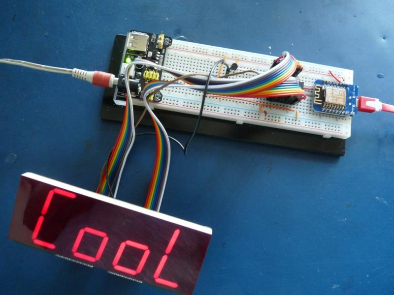
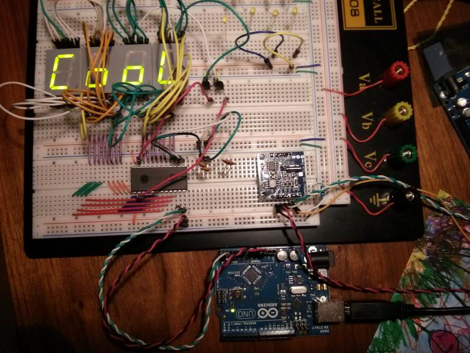
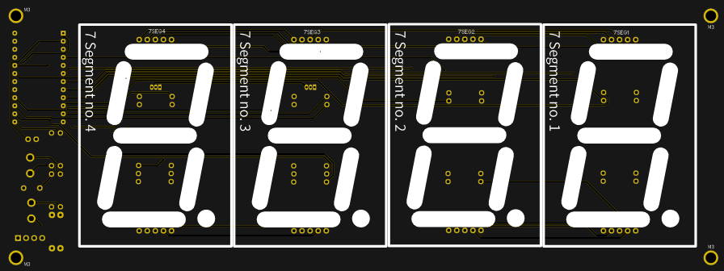
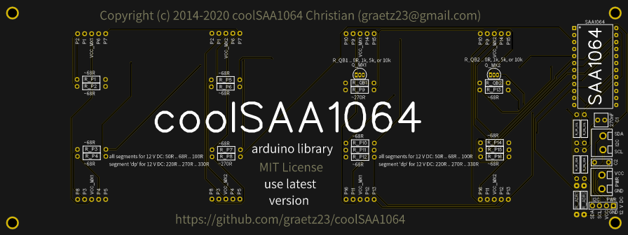
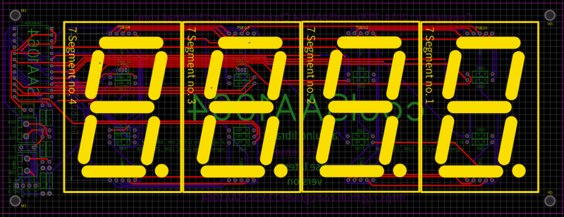

## The coolSAA1064 arduino library


### Introduction ###

The coolSAA1064 arduino library handles the 7 segment Philips / NXP SAA1064 driver.



The Philips / NXP SAA1064 drives up to four 7 segment displays via an _i2c_ communication. The 7 segments have to have a common _anode_, otherswise you have to use _a lot_ transistors. Anyway the huge advantage of the SAA1064 is, that it deals with up to 18 V of VCC, still driving a 5 V (max. 5.9 V) level on i2c wires. That allows for driving _large_ 7 segments, that are internally built by four to six LED diodes, and need an break through voltage of about 8 V to 12 V. Top of the line, the SAA1064 can control the current of the segments, and makes diming possible.

### Why

In 2013 / 2014, I experimented with arduino, the real time clock module _DS1307_, and some need for _output_. It looked somehow like this:



The SAA1064 _was still available_ and satisfied my need for output, but unfortunately there was no library for _an easy way of_ using the SAA1064 available. So I (re-)structured, utilized, and object-oriented my SAA1064 code towards this arduino library implementation.

### Revival

And in 2020 there's again the need for _output_. A friend of mine renovate some _foosball_ (colored Germany vs. Brazil) and built in some _photoelectric barrier_ to detect goals; he asked how to display a seven to one best. I told, I got these SAA1064 ICs and some library ready to go ..



However, ebay _donated_ me several orange 7 segment displays with an _alpha size_ of 2.3 inch (5.842 cm); that's a 7 seg of 6.97 cm x 4.78 cm. That arised the problem how to wire 4 x 9 and 16 resistors, a DIL 24 IC, and stuff, .. :-|



Anyway, I designed a PCB for the _fossball_, and having still in mind to build that _living room clock_ and that _thermometer display for my home brewery_, and ..



### Live

Video of dry running the coolSAA1064 library by the assembled PCB with 2.3" alpha sized 7-segments of orange color, showing the _text scrolling ability_ at the end ..

[](https://www.youtube.com/watch?v=L6sKXfyUpWc)

### Examples

**Bake object and dry run segments**
```C++
SAA1064 saa1064; // generate an object
saa1064.scollCooLSAA1064( ); // shows functionality
```

**Set the brightness easily**
```C++
saa1064.clear( ); // clean up all segments
saa1064.say( 8888 ); // switch all segments on
saa1064.setDark( ); // set output currents to 3 mA
saa1064.setNormal( ); // set output currents to 12 mA
saa1064.setBright( ); // set output currents to 21 mA
```
or try the intensity in seven steps ..
```C++
saa1064.clear( ); // clean up all segments
saa1064.say( 8888 ); // switch all segments on
for( int i = 1; i < 8; i++ ) {
  saa1064.setIntensity( i );
  delay( 250 ); // wait
}  // loop
```
**Display some number over all segment**
```C++
saa1064.clear( ); // clean up all segments
saa1064.say( 5 ); //       5
delay( 250 );
saa1064.say( 15 ); //     15
delay( 250 );
saa1064.say( 815 ); //   815
delay( 250 );
saa1064.say( 2815 ); // 2815
delay( 250 );
```

**Display some number over all segment; fill front with zeros**
```C++
saa1064.clear( ); // clean up all segments
saa1064.sayByZero( 5 ); //    0005
delay( 250 );
saa1064.sayByZero( 15 ); //   0015
delay( 250 );
saa1064.sayByZero( 815 ); //  0815
delay( 250 );
saa1064.sayByZero( 2815 ); // 2815
delay( 250 );
```

**Display some number by each segment**
```C++
saa1064.clear( ); // clean up all segments
saa1064.say( 1, 0 ); // show 1 on 1st (id 0) digit
delay( 250 );
saa1064.clear( );
saa1064.say( 2, 1 ); // show 2 on 2nd (id 1) digit
delay( 250 );
saa1064.clear( );
saa1064.say( 3, 2 ); // show 3 on 3rd (id 2) digit
delay( 250 );
saa1064.clear( );
saa1064.say( 4, 3 ); // show 4 on 4th (id 3) digit
delay( 250 );    
```

**Say some time and date**

```C++
saa1064.clear( ); // clean up all segments
delay( 250 );
saa1064.sayTime( 8, 5 );
delay( 250 );
saa1064.sayTime( 8, 15 );
delay( 250 );
saa1064.sayTime( 18, 15 );
delay( 250 );
saa1064.sayDate( 24, 01 );
delay( 250 );
saa1064.sayDateUS( 01, 24 );
delay( 250 );
saa1064.sayYear( 14 );
delay( 250 );
saa1064.sayYear( 2014 );
delay( 250 );
```

**Scroll time and date**

```C++
saa1064.scrollTime( 18, 15, 00, 250 ); // right to left by 250 ms per step
saa1064.scrollDate( 15, 2, 2014, 250 ); // right to left by 250 ms per step
```

**Use it as an amplitude**
```C++
// amplitude in levels from 0 to 7
saa1064.clear( ); // clean up all segments
for( int i = 0; i < 8; i++ ) {
  saa1064.amplitude( i );
  delay( 125 );
} // loop
for( int i = 7; i >= 3; i-- ) {
  saa1064.amplitude( i );
  delay( 125 );
} // loop
for( int i = 3; i < 6; i++ ) {
  saa1064.amplitude( i );
  delay( 125 );
} // loop
for( int i = 5; i >= 0; i-- ) {
  saa1064.amplitude( i );
  delay( 125 );
} // loop
```


**Predefined words and letters**
```C++
saa1064.clear( ); // clean up all segments
saa1064.sayFoo( ); //  writes ' foo'
delay( 250 );  
saa1064.saybAr( ); //  writes ' bar'
delay( 250 );
saa1064.sayOn( ); //   writes '  On'
delay( 250 );
saa1064.sayOFF( ); //  writes ' OFF'
delay( 250 );
saa1064.sayGO( ); //   writes '  gO'
delay( 250 );
saa1064.sayOPEn( ); // writes 'OPEn'
delay( 250 );
saa1064.sayLOAd( ); // writes 'LOAd'
delay( 250 );
saa1064.sayPLAY( ); // writes 'PLAY'
delay( 250 );
saa1064.sayDISC( ); // writes 'dISC'
delay( 250 );
```

For more have a look at the [coolSAA1064.ino](https://github.com/graetz23/coolSAA1064/blob/master/coolSAA1064.ino) and try running it.

And for more letters and their _id_ have a look at the [\_init( ) method](https://github.com/graetz23/coolSAA1064/blob/master/coolSAA1064.cpp#L107).

### Library Features

The most usable features of the library:

  - select IC's internal test mode switching on all segments,
  - select mode for two or four digits,
  - select the intensity of the segments by dark, normal, bright,
  - select the intensity of the segments by an integer 1 .. 7,
  - display a number by 0 to 9999 as integer; blank not used,
  - display a number by 0000 to 9999 as integer; not blanking,
  - display hex values 0000 to FFFF as integer 0 .. 15,
  - display letters by an interal code 16 .. following,
  - display a digit as integer on a selected segment as update,
  - display a digit as byte on a selected segment as update,
  - display a digit on a selected segment as register update,
  - display four digits seperately as integer or blank by -1,
  - display four digits seperately as bytes,
  - display one of a predefined word; CooL, Foo, bAr, ...,
  - display a predefined smiley; 8-],
  - display the time directly,
  - display the date and the date in US and year,
  - scroll any integer or internal codes by milliseconds per step,
  - scroll time by 'hour-minute-second' from right to left,
  - scroll date by 'day-month-year' from right to left,
  - display an amplitude from right to left by an integer of 0 .. 7,
  - display all possible letters that are stored internal,
  - display all byte coding over all segments; takes time!

### Implementation

All necessary I2C communications are realized by only three methods:

  - \_set( .. ); // set the configuration of SAA1064; once implemented,
  - \_say( .. ); // tell bytes for displaying to SAA1064; two times implemented.

All other methods for communicating are using these two methods.

### Releases

There are [stable releases available](https://github.com/graetz23/coolSAA1064/releases) by cloning or downloading and unzipping.

### Remarks

Everything was coded using:

  - [**SAA1064 IC**](https://www.nxp.com/docs/en/application-note/AN264.pdf) from NXP,
  - [**7 Segments**](https://de.wikipedia.org/wiki/Segmentanzeige) displays; _in German langugage only_,  
  - [**arduino**](https://www.arduino.cc/) project,
  - [**arduino IDE**](https://www.arduino.cc/en/main/software) _around 2014_,
  - [**arduino Makefile**](https://github.com/sudar/Arduino-Makefile) for automated building,
  - [**atom**](https://atom.io/) editor,
  - [**Gnome**](https://www.gnome.org/) as window manager,
  - and [**debian**](https://www.debian.org/) GNU/Linux.

have fun :-)

## Change Log

**20200414**
  - bug fix on added say word method; was in byte code not array index!

**20200413**
  - released version v1.1:
    - due to [issue \#1](https://github.com/graetz23/coolSAA1064/issues/1), the created _setup()_ method for calling 'Wire.begin()',
    - by version 1.1, call 'saa1064.setup()' in arduino's 'setup()'.
  - released version v1.:
    - added standard say mathods:
      - sayOn, sayOFF, and sayGO,
      - sayOPEn, sayPLAY, sayLOAd, and sayDISC.
    - Therefore I
      - moved '-' from id 26 to 27,
      - moved ']' from id 27 to 28,
      - moved '°' from id 28 to 29,
      - added 'Y' to as id 26.
    - moved \_init() method to line _100_ to fix it there for referencing,
    - In honors to the _discontinued_ SAA1064, rewritten readme, added pictures, examples, ..

**20140215**
  - first stable implementation available.
